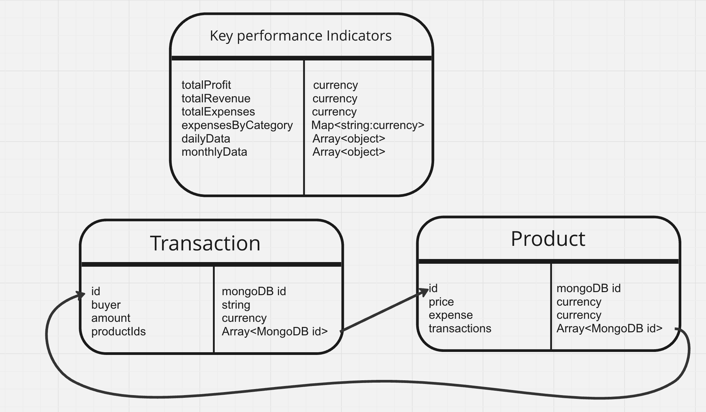

# BusinessFinanceDashboard - Capitalyze

## Project Overview
This Financial Analytics Dashboard is a comprehensive full-stack application designed to provide in-depth financial insights and predictive analytics for business owners. It offers interactive data visualizations for key performance indicators, product and order management, and revenue forecasting using a machine learning regression model.

## Video Demo
[Video Demo]

## Features
- Interactive charts (area, line, bar, pie, scatter plots) for financial data visualization
- Predictive analytics for revenue forecasting
- Responsive and user-friendly interface
- Fully implemented back-end that fetches and saves user data

## Tech Stack
### Frontend
- React
- TypeScript
- Vite (for project scaffolding)
- Material UI (for component library)
- Material UI Data Grid (for tables)
- Recharts (for data visualization)
- Redux Toolkit (for state management)
- Redux Toolkit Query (for API calls)
- React Router (for navigation)
- Hero Icons (for iconography)

### Backend
- Node.js
- Express.js
- MongoDB
- Mongoose (for database modeling)

### Machine Learning
- regression.js (for predictive analytics)

## Setup and Installation
Follow these steps to run the project locally:

1. **Clone the Repository:** Clone this repository to your local machine using `git clone`.

2. **Navigate to the Server Directory:** Open a terminal and navigate to the server directory:

   ```bash
   cd BusinessFinanceDashboard
   cd Server
   ```

3. **Install Dependencies and Run Back-end Server** 

   ```bash
   npm install
   npm run dev
   ```
4. **Navigate to the Client Directory:** Open a new terminal and navigate to the client directory:

   ```bash
   cd ..
   cd Client
   ```
5. **Install Dependencies and Run the application**

   ```bash
   npm install
   npm run dev
   ```
6. **Access the Application**: Go to your browser and type the following URL: http://localhost:5173/

## Database Schema



### Data Flow
The above figure shows how exactly the databased was constructured and stored, the schema was created before its implementation. The following is just a verbal commentary of the above figure: 

- Product Creation: Products are added to the Product table with their respective details such as id, price, and expense.
- Transaction Recording: When a transaction occurs, it is recorded in the Transaction table. The transaction entry includes the buyer information, amount, and productIds of the purchased items.
Linking Transactions and Products: Each transaction is linked back to the products involved through the productIds array in the Transaction table and the transactions array in the Product table.
- KPI Updates: As transactions are recorded, the Key performance Indicators (KPI) table is updated to reflect the new total profit, revenue, and expenses. Additionally, daily and monthly data are appended to their respective arrays for detailed analysis.
- Expense Tracking: The expensesByCategory field in the Key performance Indicators table is updated to track how expenses are distributed across different categories, aiding in financial analysis and budget management.

## Future Enhancements
- Add user login and authentication
- Create admin dashboard for easy configurability
